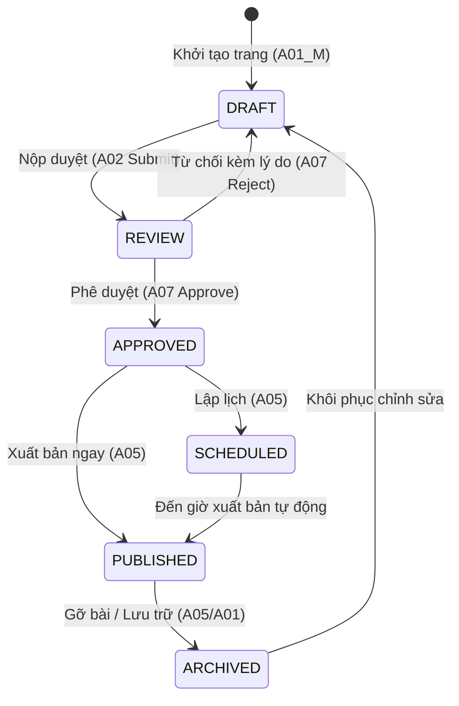

# 🏢 TIÊU CHUẨN NGHIỆP VỤ QUẢN TRỊ ADMIN (CMS & BACKOFFICE GOVERNANCE)
## ENTERPRISE ADMIN OPERATIONS & REGULATORY COMPLIANCE SPECIFICATIONS (LEVEL 1)

> **Cổng thẩm định**: GATE 4 (BA-Audit)  
> **Dự án áp dụng**: Cổng Quản trị Vận hành, Content Management System (CMS), Giám sát Rủi ro & Pháp lý.  
> **Tham chiếu chuẩn mực**: SFC Hong Kong Regulatory Standards, Hong Kong Personal Data (Privacy) Ordinance (PDPO), ISO 27001 Access Control, Sarbanes-Oxley (SOX) Segregation of Duties.

---

## 🏛️ 1. PHÂN QUYỀN VAI TRÒ & NGUYÊN TẮC TÁCH BẠCH QUYỀN HẠN (RBAC & SEGREGATION OF DUTIES)

1. **Quy Tắc 4 Mắt (Four-Eyes Principle / Maker-Checker)**:
   - **Tách biệt tuyệt đối giữa Người Tạo (Author/Maker) và Người Duyệt (Approver/Checker)**: Nhân viên tạo hoặc chỉnh sửa bài viết/chiến dịch/biểu mẫu tuyệt đối bị vô hiệu hóa nút Duyệt (`Approve`) đối với chính bản ghi của mình.
   - **Chuỗi thẩm quyền 3 lớp**: `Author` $\longrightarrow$ `Approver (Legal/Compliance)` $\longrightarrow$ `Publisher`.
   - **Giao diện bắt buộc**: Nút `Approve` phải ở trạng thái Disabled hoặc ẩn đi nếu `currentUser.id === record.createdBy`, kèm tooltip cảnh báo rõ ràng.
2. **Cách Ly Đa Thực Thể & Khu Vực (Multi-Entity & Geographic Isolation)**:
   - Hệ thống quản trị hỗ trợ đa quốc gia (HK, SG, VN) và đa thực thể (MAHK, MASG).
   - Quản trị viên chỉ được cấp quyền xem và chỉnh sửa dữ liệu thuộc phạm vi thẩm quyền (`Country Scope` & `Entity Scope`). Tuyệt đối cấm rò rỉ dữ liệu chéo giữa các pháp nhân.

---

## 🛡️ 2. TÍNH LIÊN TỤC VÀ TOÀN VẸN CỦA DỮ LIỆU (DATA LINEAGE & INTEGRITY)

1. **Bảo Toàn Trường Dữ Liệu (Field Integrity)**:
   - Toàn bộ dữ liệu khởi tạo từ Modal tạo mới (`A01_M: Title, Slug, Locale, Template`) bắt buộc phải ánh xạ chính xác $1:1$ sang Trình soạn thảo (`A02: Editor`) và hiển thị đúng trên Bảng danh mục (`A01`).
   - Cấm hiện tượng rơi rụng dữ liệu (Data drop) hoặc tự sinh giá trị mặc định sai lệch khi chuyển màn.
2. **Khóa Mẫu Toàn Cục (Template Locking Governance)**:
   - Các thành phần khung sườn toàn cục (`Header`, `Footer`, `Global Disclaimers`) bắt buộc phải bị khóa chỉnh sửa tại các màn hình bài viết lẻ (`A02`).
   - Chỉ duy nhất màn hình quản trị linh kiện chung (`A13: Common Components`) mới có thẩm quyền mở khóa cấu hình này.

---

## ⚖️ 3. TUÂN THỦ PHÁP LÝ & BẢO VỆ DỮ LIỆU CÁ NHÂN (LEGAL & DATA PRIVACY)

1. **Tuân Thủ Pháp Lệnh Dữ Liệu Cá Nhân (PDPO Hong Kong Compliance)** trên Form & Leads (`A10`):
   - Mọi biểu mẫu thu thập thông tin khách hàng tiềm năng bắt buộc phải có:
     * Checkbox xác nhận điều khoản dịch vụ và chính sách bảo mật (Privacy Policy Consent) riêng biệt, không được check sẵn (No Pre-ticked boxes).
     * Tùy chọn Opt-in cho mục đích tiếp thị trực tiếp (Direct Marketing Opt-in).
     * Thông báo mục đích thu thập thông tin cá nhân (Personal Information Collection Statement - PICS).
2. **Tách Biệt Văn Bản Pháp Lý (Separation of Legal Documents)** trên `A11`:
   - Các tài liệu pháp lý điều khoản sản phẩm tài chính, biểu phí và cảnh báo rủi ro bắt buộc phải có vòng đời riêng: Khai báo ngày có hiệu lực (`Effective Date`), số hiệu phiên bản (`Version major.minor`), và cơ quan thẩm quyền (`Jurisdiction: SFC/HKEX`).

---

## 🔄 4. MÔ HÌNH TRẠNG THÁI NỘI DUNG (CONTENT LIFECYCLE STATE MACHINE)

- **Quy tắc bất biến**:
  - Không một bản ghi nào được phép chuyển thẳng từ `DRAFT` sang `PUBLISHED` nếu chưa qua bước `REVIEW & APPROVE` tại `A07`.
  - Mọi thao tác chuyển trạng thái bắt buộc ghi vết kiểm toán vĩnh viễn (`Audit Trail: User ID, Timestamp, Old Status, New Status, Reason Note`).
